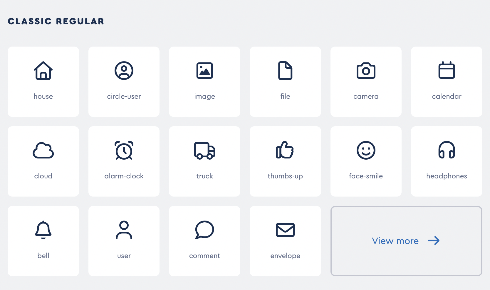
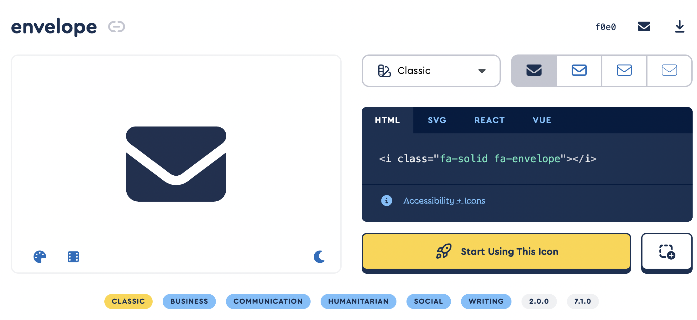

I recently gave my website a much-needed facelift, and I wanted to add icons inside the "Highlights" section to distinguish featured projects and blog posts. I didn't want to use emojis because they felt a little too casual and out of place. After a little bit of Google searching, I found [Font Awesome](https://fontawesome.com/), an icon library that allows you to embed icons in your HTML. 

I was so excited when I found this site, because they have over 2,000 icons that can be used for free, all of which maintain a consistent styling. 


*Screenshot from the free icon page*

The first thing I had to do to incorporate Font Awesome into my website was add the style sheet to my `_includes/head.html` page:

```
  <link rel="stylesheet" href="https://cdnjs.cloudflare.com/ajax/libs/font-awesome/6.6.0/css/all.min.css">
```

Once that is in place, any of the free icons can be added to your HTML. After you find one you want to use, all you have to do is click on that icon, and a window will pop up with the HTML snippet you need to add the icon:


*Screenshot from the envelope icon pop-up window*

I'm very pleased with how easy Font Awesome was to set up, and the icons helped me keep a clean and consistent style for my website.